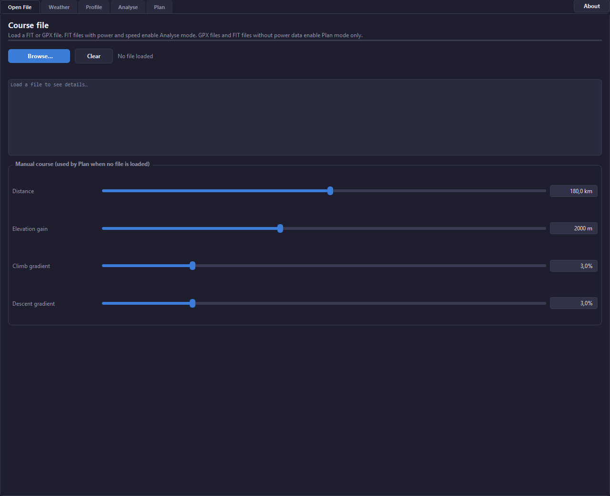
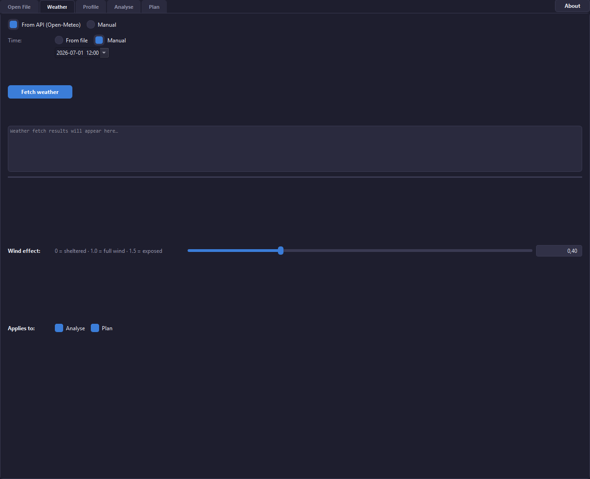
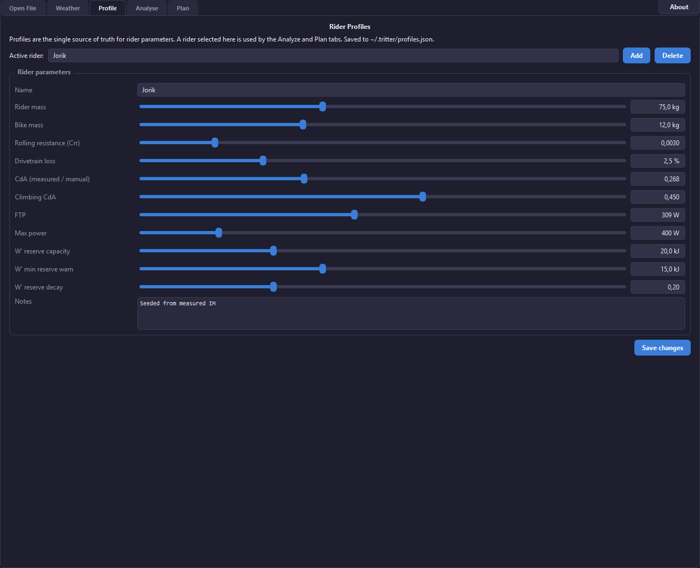
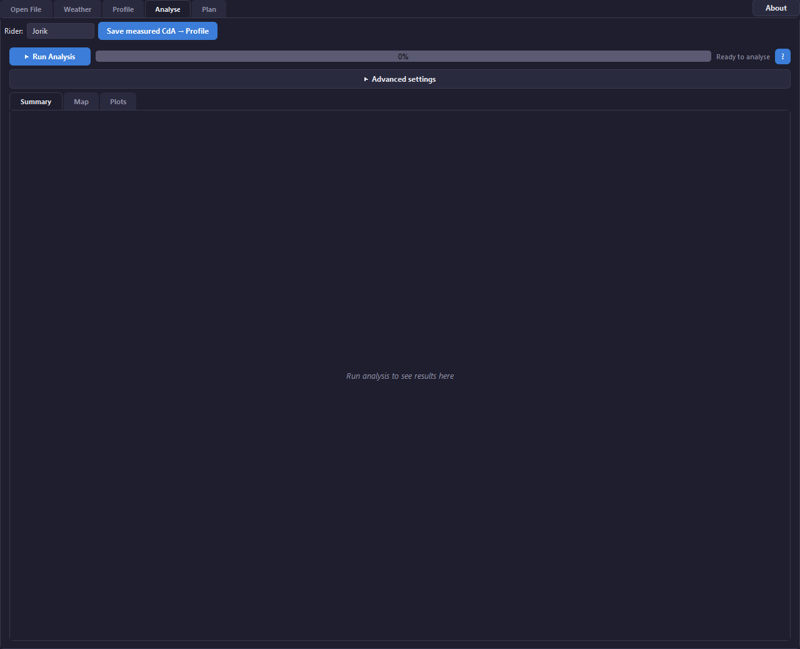
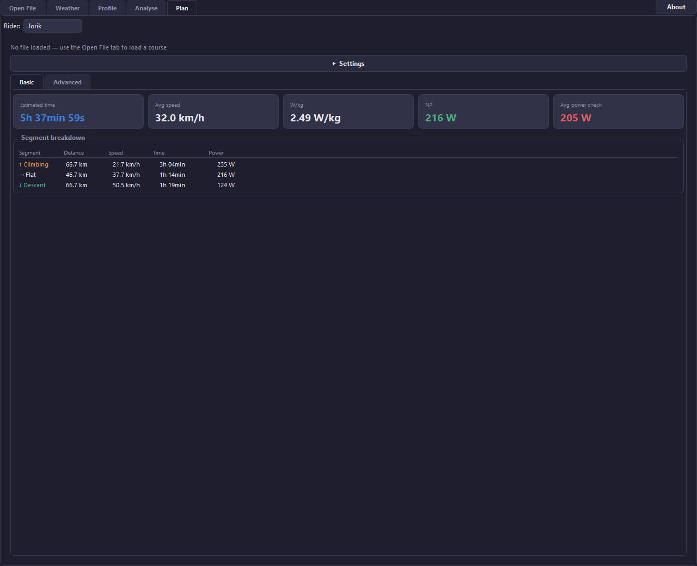

# TriTTer

<p align="center">
  
</p>

<p align="center">
  <b>A unified cycling toolkit for aerodynamic analysis and race pacing.</b>
</p>

---

## What It Does

TriTTer combines two core capabilities in a single desktop app:

- **Analyse** — Load a recorded FIT ride and estimate your aerodynamic drag area (CdA) per steady segment. Includes weather and elevation enrichment, interactive map, and detailed plots.
- **Plan** — Load a course (FIT or GPX) and estimate finish time and power targets using a fatigue-aware durability model. Export a power-course FIT file and optionally push it directly to a Hammerhead bike computer via USB.

Both modes share a common weather engine, air-density model, and a unified **rider profile** system.

## Screenshots

| Open File | Weather | Profile |
|:-:|:-:|:-:|
|  |  |  |

| Analyse | Plan |
|:-:|:-:|
|  |  |

## Features

### Open File
Load a FIT or GPX file. FIT files with power and speed data enable Analyse mode. GPX files and FIT files without power data enable Plan mode only. A manual course editor lets you define distance, elevation gain, and gradient when no file is loaded.

### Weather
Fetch real-time weather data from the [Open-Meteo API](https://open-meteo.com/) along your route, or enter conditions manually. Adjust the **wind effect** slider (0 = sheltered, 1.0 = full wind, 1.5 = exposed) to model your expected wind exposure. Weather applies to both Analyse and Plan.

### Profile
Manage multiple rider profiles with parameters including mass, CdA, rolling resistance (Crr), drivetrain loss, FTP, W′ reserve, and more. Profiles are the single source of truth — select a rider here and it carries across all tabs. Saved to `~/.tritter/profiles.json`.

### Analyse
Compute CdA from a recorded ride:
- Detects steady segments from speed, power, and slope stability
- Splits segments into sub-segments for local CdA estimation
- Models aerodynamic, rolling, gradient, and inertial power
- Weather-aware wind modeling with yaw angle reporting
- Weighted CdA summary with outlier rejection
- Interactive folium map and matplotlib plots
- Save a measured CdA directly back into the active rider profile

### Plan
Estimate time and power for an upcoming course:
- Fatigue-aware durability model with W′ reserve tracking
- Segment breakdown (climbing / flat / descent) with per-segment speed, time, and power
- Export a structured power-course FIT file
- Push the course to a **Hammerhead Karoo** bike computer via ADB over USB
- Basic and Advanced settings views

## Installation

### 1. Clone the repository

```powershell
git clone https://github.com/your-username/TriTTer.git
cd TriTTer
```

### 2. Create a virtual environment and install dependencies

```powershell
python -m venv .venv
.\.venv\Scripts\Activate.ps1
pip install -r requirements.txt
```

### 3. (Optional) ADB for Hammerhead push

To push power courses to a Hammerhead Karoo via USB, place the [Android platform-tools](https://developer.android.com/tools/releases/platform-tools) in the `platform-tools/` folder, or ensure `adb` is available on your PATH. Connect your Karoo via USB and enable developer mode on the device.

## Usage

### GUI (recommended)

```powershell
python src/main.py
```

Or use the build helper script:

```powershell
.\build.ps1 run
```

### CLI

```powershell
# Analyse a recorded ride
python src/main.py --cli --mode analyze --file data/your_ride.fit

# Plan a course
python src/main.py --cli --mode plan
```

## Building a Standalone Executable

Build a single-file Windows executable with PyInstaller:

```powershell
.\build.ps1 build
```

The output is `dist/TriTTer.exe`. To build a one-directory bundle instead:

```powershell
.\build.ps1 buildfolder
```

<details>
<summary><b>Project Architecture</b></summary>

```
src/
  main.py              Entry point (GUI default; CLI via --cli --mode analyze|plan)
  core/                Shared core
    air.py             Humidity-corrected air-density model
    weather.py         Open-Meteo weather service
    config.py          Default parameters and API endpoints
    profiles.py        Rider profiles (JSON persistence)
  analyze/             Analyse mode
    qt_gui.py          Analyse GUI
    analyzer.py        Segment detection and CdA calculation
    fit_parser.py      FIT parsing and unit normalization
    elevation.py       Elevation enrichment (Open-Elevation / Open-Meteo)
    segment_splitter.py  Steady-segment splitting
    cli.py             CLI interface
    icons/             App icon assets
  plan/                Plan mode
    plan_gui.py        Plan GUI with ADB push
    course.py          Course loading (FIT/GPX)
    physics.py         Physics model
    durability_model.py  Fatigue / W′ model
    fit_export.py      Power-course FIT export
    weather_plan.py    Weather sampling for plan
  ui/                  Top-level shell
    app_shell.py       Five-tab window
    profile_tab.py     Rider profile editor
    weather_tab.py     Weather configuration
    open_file_tab.py   File loader and manual course
    theme.py           Dark theme
data/                  Sample FIT rides
platform-tools/        ADB binaries for Hammerhead push
```

</details>

## License

Licensed under MIT. See [LICENSE](LICENSE).

## Credits

- App icon: "Time Trial Bike" by [Izwar Muis](https://www.flaticon.com/authors/izwar-muis) from [Flaticon](https://www.flaticon.com/free-icon/time-trial-bike_17736701) (free with attribution).
- Weather data: [Open-Meteo API](https://open-meteo.com/) (open-source weather API).
